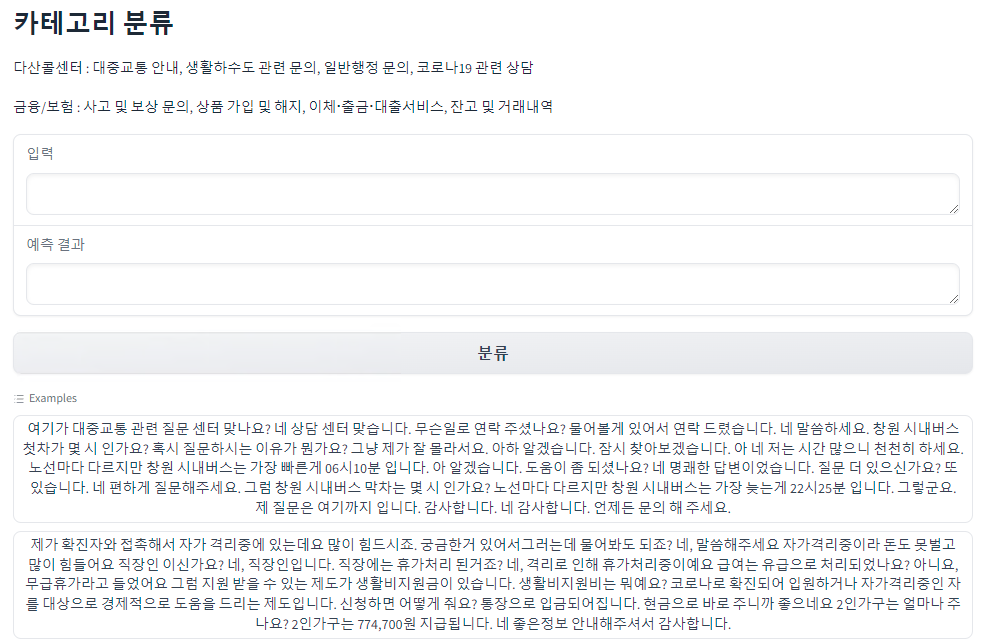

# Complaint-Category-Classification
KoGPT2 기반의 민원 카테고리 분류
## Before starting
해당 프로젝트는 상담 대화를 기반으로 한 [KoGPT2](https://github.com/SKT-AI/KoGPT2?tab=readme-ov-file) 기반의 민원 카테고리 분류 모델입니다.

이에 AI-HUB의 [민원(콜센터) 질의-응답 데이터](https://www.aihub.or.kr/aihubdata/data/view.do?currMenu=&topMenu=&aihubDataSe=data&dataSetSn=98) 데이터의 `금융/보험`, `다산콜센터` 도메인을 활용합니다.

또한 Cross Entropy의 클래스 불균형 문제 완화를 위해 Focal Loss를 적용하였음을 알려드립니다.

## Introduce Model

### KoGPT2 (한국어 GPT-2) Ver 2.0

[GPT-2](https://openai.com/blog/better-language-models/)는 주어진 텍스트의 다음 단어를 잘 예측할 수 있도록 학습된 언어모델이며 문장 생성에 최적화 되어 있습니다. `KoGPT2`는 부족한 한국어 성능을 극복하기 위해 40GB 이상의 텍스트로 학습된 한국어 디코더(`decoder`) 언어모델입니다.

<table><tr><td>
    <center></center>
</td></tr>
</table>

### Tokenizer

[`tokenizers`](https://github.com/huggingface/tokenizers) 패키지의 `Character BPE tokenizer`로 학습되었습니다.

사전 크기는 51,200 이며 대화에 자주 쓰이는 아래와 같은 이모티콘, 이모지 등을 추가하여 해당 토큰의 인식 능력을 올렸습니다.
> 😀, 😁, 😆, 😅, 🤣, .. , `:-)`, `:)`, `-)`, `(-:`...

또한 `<unused0>` ~ `<unused99>`등의 미사용 토큰을 정의해 필요한 테스크에 따라 자유롭게 정의해 사용할 수 있게 했습니다.

```python
> from transformers import PreTrainedTokenizerFast
> tokenizer = PreTrainedTokenizerFast.from_pretrained("skt/kogpt2-base-v2",
  bos_token='</s>', eos_token='</s>', unk_token='<unk>',
  pad_token='<pad>', mask_token='<mask>')
> tokenizer.tokenize("안녕하세요. 한국어 GPT-2 입니다.😤:)l^o")
['▁안녕', '하', '세', '요.', '▁한국어', '▁G', 'P', 'T', '-2', '▁입', '니다.', '😤', ':)', 'l^o']
```

### Model

| Model       |  # of params |   Type   | # of layers  | # of heads | ffn_dim | hidden_dims |
|--------------|:----:|:-------:|--------:|--------:|--------:|--------------:|
| `kogpt2-base-v2` |  125M  |  Decoder |   12     | 12      | 3072    | 768 |

## Environment Setting
Complaint-Category-Classification에 사용된 환경에 대해 소개합니다.

  ```
  GPU : GeForce RTX 3080
  python : 3.9.18
  CuDA : 11.6
  ```

## Install
### 필요 라이브러리 설치

  ```
  python install.py
  ```

## Usage
Data Preprocessing, Training, Test의 전반적인 과정은 src 함수 내 파일을 통해 진행됩니다.

따라서 현재 위치를 src로 변경한 상태임을 가정합니다.

### 1. Data Preprocessing

Training을 위해서는 Json 형식의 raw 파일을 데이터프레임으로 만들어야 할 필요가 있습니다. 

이를 위해 [민원(콜센터) 질의-응답 데이터](https://www.aihub.or.kr/aihubdata/data/view.do?currMenu=&topMenu=&aihubDataSe=data&dataSetSn=98)의 데이터를 data/raw에 넣어줍니다.

raw 폴더의 구조는 아래와 같이 되어야 합니다.

  ```
  1.Training
    > 라벨링데이터_220121_add
      >> 다산콜센터
      >> 금융보험
  2.Validation
      >> 다산콜센터
      >> 금융보험
  ```

Json 형식의 데이터를 데이터프레임으로 변환하기 위해 아래의 코드를 실행합니다.

  ```
  python make_dataset.py
  ```
  
이 코드의 결과로 `data/df`에 `train_df.csv`, `test_df.csv` 파일이 생성됩니다.

### 2. Fine-Tuning

Data Preprocessing을 통해 만들어진 csv 파일을 기반으로 Fine-Tuning을 진행합니다.

Pretrained Model은 `transformers.GPT2Model`의 `skt/kogpt2-base-v2`을 활용합니다.

아래의 코드를 실행해 Model Fine-Tuning을 진행합니다.

  ```
  python train.py
  ```

학습에는

Cross Entropy Loss의 데이터 불균형 처리 문제를 완화하기 위한 Focal Loss가 활용되었습니다.

또한 EarlyStopping을 적용함으로써 최적의 모델을 저장하도록 설정했습니다.

학습의 결과로 Root 폴더에 있는 `model` 폴더에 `checkpoint.pt`파일이 생성됩니다.

### 3. Test

학습의 결과를 확인하기 위해 Data Preprocessing 과정에서 생성했던 `test_df.csv`를 활용합니다.

평가 지표는 아래 코드를 실행해 `Classification Report`를 확인할 수 있습니다.

  ```
  python test.py
  ```

해당 프로젝트를 진행하며 `KoBERT` 기반 분류 모델도 함께 비교했습니다.

모델의 성능은 `KoBERT` 기반의 모델과 유사했으나 추론 속도 면에서는 `KoGPT2` 기반의 모델이 훨씬 빠름을 확인했습니다.

또한 `Focal Loss`를 Loss Function으로써 사용하면서 `Cross Entropy Loss`를 사용할 때보다 전반적인 성능이 향상되는 것을 확인했습니다.

### 4. Demo

학습된 모델의 추론 결과를 더 편리하게 테스트할 수 있도록 `gradio`를 활용한 demo 페이지를 함께 제작했습니다.

테스트 데이터 중 Class 별 랜덤으로 1개의 데이터씩 추출해 예제로 제작했습니다.

해당 파일은 `src` 폴더가 아닌 상위 폴더에서 진행합니다.

아래 코드를 실행해 gradio demo를 진행할 수 있습니다.

  ```
  python demo.py
  ```

해당 파일의 Server Port는 11031으로 되어 있으나 해당 Port Number는 자유롭게 제거 및 변경이 가능합니다.

<table><tr><td>
    <center></center>
</td></tr>
</table>